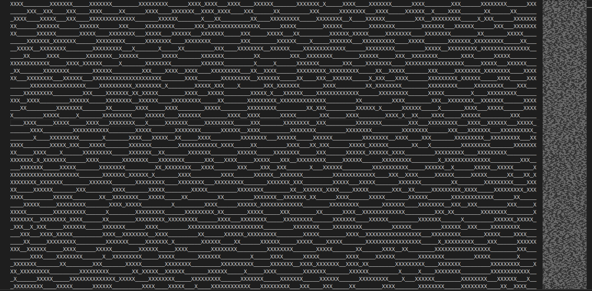
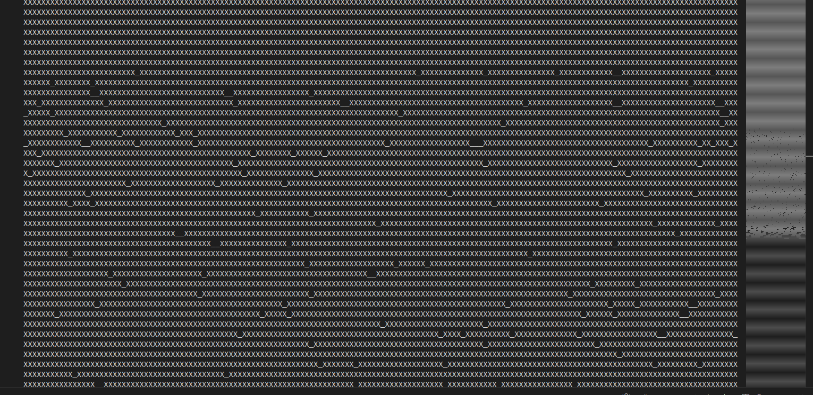
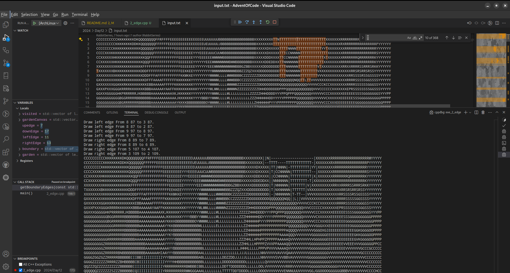
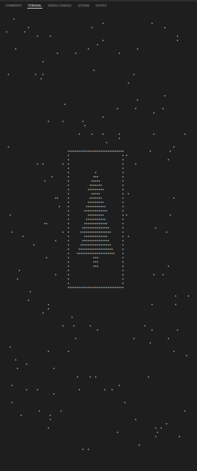
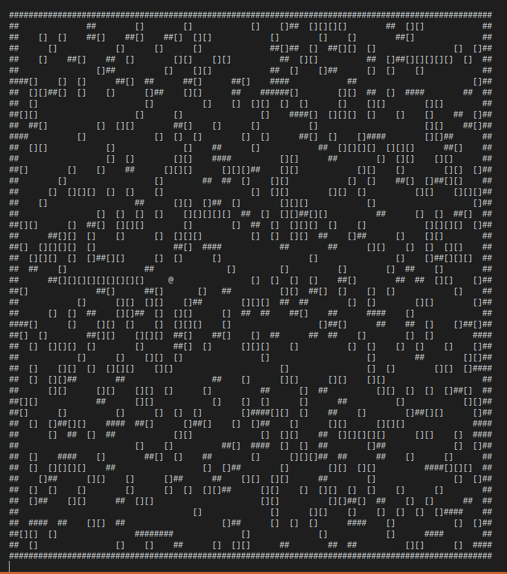

# 2024 Summaryy

## 📜 Worth future utility

### Day 9 Disk Fragmenter

  

  

### Day 11 Plutonian Pebbles

The multithreading approach has crashed my OS many times. The dynamic programming method is fruitful. However, what if the position of spawned stones matters in the result calculation?

### Day 12 Garden Groups

This problem guides a way of image edge detection algorithm.

  

### Day 14 Restroom Redoubt

  

### Day 15 Warehouse Woes

A simple box pushing game.

  

### Day 16 Dijkstra + State transfer machine

Prove:

1. Each vertex in the shortest path is enqued in the order of the shotest path itself.
2. Any equivalent cost path is enqued once.
3. Once a vertex is relaxed, the path is already in **current** optimal status, this status will be settled when poped from the priority queue.

### Day 24 Crossed Wires

[Cascading Full adder](./2024/Day24/GatesVisualize.md)
