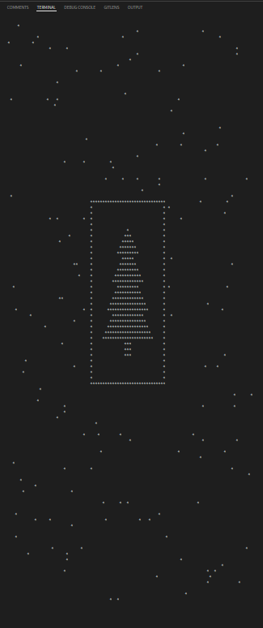

# 2024 Summary

### Day 14 Restroom Redoubt

<div align="center">
  
</div>

### Day 15 Warehouse Woes

A simple box pushing game.
<div align="center">
  
</div>

### Day 16 Dijkstra + State transfer machine

Prove:

1. Each vertex in the shortest path is enqued in the order of the shotest path itself.
2. Any equivalent cost path is enqued once.
3. Once a vertex is relaxed, the path is already in **current** optimal status, this status will be settled when poped from the priority queue.

### Day 22 Monkey Market

Through trial, I have given up the multithreading apporach due to time insufficient. I think the reason might be the cache missing in the competitive occupation among threads.

### Day 24 Crossed Wires

[Cascading Full adder](./main/year2024/Day24/GatesVisualize.md)

## 📆 TODOs

- [x] Change day 3 algorithm to [regular expression](https://en.cppreference.com/w/cpp/regex/ecmascript) implementation ([C++ 11 feature](https://en.cppreference.com/w/cpp/regex)).
- [x] What is day 13 algorithm trying to testify?
- [ ] Building java repo.
- [ ] Construct the project to a CMake test project.
- [ ] Add cache to Dijkstra in Day 21 solution.
- [ ] ~~Add A*algorithm to Day 16 solution.~~ Nah, A* algo is not suitable for penalty shortest path problem.
- [ ] Change Day 20 distance calculation to Manhattan distance.
- [ ] Github issue at: [13110](https://github.com/microsoft/vscode-cpptools/issues/13110)
- [ ] Time efficency: Mutex > future async > single thread algorithm (VSCode debugger will try tracking the allocation variable data, thus recursive algorithm will be slowed down severely).
- [ ] Time efficency: Fixed size array > linked list > bucket> ... > ; stack variable > heap variable
- [ ] VSCode tracking memory of big HashMap/unordered_map cost extremely massive amount of time, execute the program manually.
- [ ] Change all dijkstra algorithm to static DP implementation instead of state machine path record within the node in queue.
- [ ] I think there might be a way to transform top-down memoization recursion (topological sort of the transpose) to bottom-up DP (reverse topological sort), and also to heuristic search? But I haven't figured out how. (See Introduction to Algorithms Ch 15 and 2023 Java Day12).

<!-- <div id="TODOList" style="transform: translateX(30px);padding-bottom: 20px">
    <input type="checkbox" checked="true" disabled="true" >Change day 3 algorithm to <a href="https://en.cppreference.com/w/cpp/regex/ecmascript">regular expression</a> implementation <a href="https://en.cppreference.com/w/cpp/regex">(C++ 11 feature)</a>.<br>
    <input type="checkbox" disabled="true" >What is day 13 algorithm trying to testify?<br>
    <input type="checkbox" disabled="true" >Get a lisence.<br>
    <input type="checkbox" disabled="true" >Construct the project to a CMake test project.<br>
    <input type="checkbox" disabled="true" >Add cache to Dijkstra in Day 21 solution.<br>
    <input type="checkbox" disabled="true" >Github issue at: <a href="https://github.com/microsoft/vscode-cpptools/issues/13110">13110</a><br>
    <input type="checkbox" disabled="true" >Mutex > future async > normal algorithm (vscode debugger will try tracking the calling stack, thus recursive algorithm will be slowed down serverely)<br>
</div> -->

## Valgrind log

```bash
cmake --preset=unix-release
cmake --build --preset=unix-release
cd build/unix-release/Cpp/2024
valgrind --track-origins=yes --leak-check=full --show-leak-kinds=all -s ./solution > out.log 2> valgrind.log
```

## Refs
- [MSVC Compiler Options](https://learn.microsoft.com/en-us/cpp/build/reference/compiler-options-listed-alphabetically?view=msvc-170)

```log
❯ cat valgrind.log 
==3151== Memcheck, a memory error detector
==3151== Copyright (C) 2002-2024, and GNU GPL'd, by Julian Seward et al.
==3151== Using Valgrind-3.25.1 and LibVEX; rerun with -h for copyright info
==3151== Command: ./solution
==3151==
---                                             Finished                                                ---
---                                             Finished                                                ---
---                                             Finished                                                ---
...
...
==3151==
==3151== HEAP SUMMARY:
==3151==     in use at exit: 0 bytes in 0 blocks
==3151==   total heap usage: 2,793,816 allocs, 2,793,816 frees, 1,699,015,747 bytes allocated
==3151==
==3151== All heap blocks were freed -- no leaks are possible
==3151==
==3151== ERROR SUMMARY: 0 errors from 0 contexts (suppressed: 0 from 0)
```