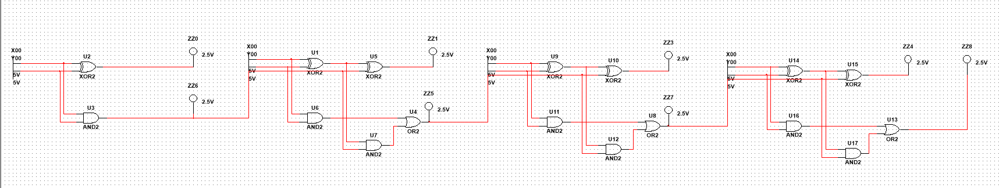
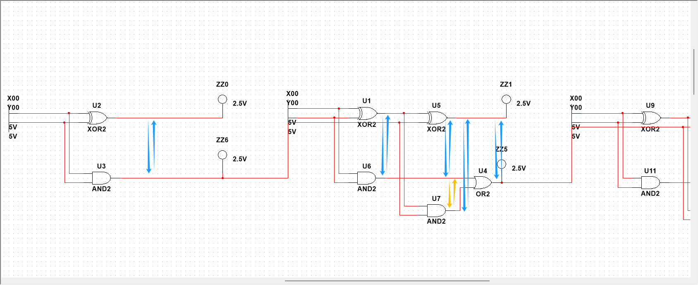

# FullAdder

## Multisim Cascading Fulladder diagram



## Solution 1

To begin with, suppose the carrier wire in the cascading adder has been found. As **there are no loops**(this condition is important), so the gates can't be swapped from latter gates to former gates. That makes the situation a lot simplifed. Thus, there can only exist five prossible swap (~~I haven't sort them out in a more practical way~~ See [Multisim diagram](./FullAdder.ms14)):



So to check one specific cascading level in the system, five gates input and output must match the specific rules, see [Source Code](./TinkerWithGates.h)

For detailed visualization see [Mermaid diagram](#mermaid-diagram)

## Solution 2

A second way is use the fact that $z_{xx}$ is processed only once, and once it is determined u can permutate the *valid* wires ,at current level, before the $z_{xx}$ output to get it right.

## Mermaid diagram

Regex convert result

```regex
(.+)\s(?:AND|OR|XOR)\s(.+)\s->\s(.+)
$1 & $2-->$3
```

```mermaid
flowchart-elk TD
    y40 & x40-->wdr
    kpc & jsd-->chv
    jwm & nbr-->pbb
    mrn & mck-->z31
    x37 & y37-->tjp
    x13 & y13-->jdm
    nfw & bbc-->wkc
    y02 & x02-->qff
    tdg & sjk-->z35
    pjv & fnq-->hrr
    x36 & y36-->mdk
    bnf & vcn-->kbg
    rfk & qcq-->mnr
    x38 & y38-->bbq
    ghr & tjp-->z37
    x40 & y40-->vtq
    x39 & y39-->drm
    bcj & qff-->jwm
    y25 & x25-->fnq
    jdm & wkc-->nrm
    y30 & x30-->wpg
    mmp & tjk-->rbc
    x17 & y17-->dbh
    x06 & y06-->pgb
    wpg & jtf-->sqj
    bgs & rbc-->bvb
    jdq & gqw-->qbq
    rqf & rjt-->z02
    mdk & cbd-->ghr
    y32 & x32-->hvk
    psj & jfw-->z21
    x36 & y36-->wvp
    wvd & dgc-->fqf
    dds & kmh-->z33
    sfv & rdb-->qmq
    mvk & gkm-->z04
    y22 & x22-->wkb
    wwg & bbp-->hnd
    djv & mqd-->fgt
    wkb & nfn-->z22
    bkn & ssg-->gng
    nfn & wkb-->tgj
    y41 & x41-->wvd
    qtk & jnq-->wwg
    x21 & y21-->jpq
    kjb & bcm-->z34
    x28 & y28-->drt
    cqk & hns-->z15
    x10 & y10-->ksw
    dch & tsc-->fkr
    x44 & y44-->nct
    y20 & x20-->bgs
    ggh & bbq-->bkn
    pgb & jbb-->kth
    x01 & y01-->vqv
    jfs & wsb-->dqt
    twn & tkb-->jkw
    y18 & x18-->smg
    ttm & tcv-->jtf
    mfr & scw-->bks
    x00 & y00-->jfs
    bns & qjr-->tgq
    y03 & x03-->nbr
    ggh & bbq-->z38
    y43 & x43-->rdb
    qht & kbg-->z08
    jtf & wpg-->z30
    bgf & fqf-->fpf
    gng & drm-->z39
    y09 & x09-->bbp
    hmv & fpf-->sfv
    kjb & bcm-->kbp
    x15 & y15-->hns
    x35 & y35-->sjk
    bns & qjr-->z14
    hfw & pjj-->dds
    qbq & krf-->jbb
    vtq & dpf-->cvp
    x21 & y21-->jfw
    rfk & qcq-->z18
    y02 & x02-->rjt
    wvp & rdh-->z36
    y39 & x39-->wjk
    njw & bvb-->psj
    y09 & x09-->rbr
    qdp & kcs-->bnf
    qmq & spr-->cvc
    x33 & y33-->rdv
    sjk & tdg-->ctf
    y31 & x31-->mck
    hbj & jdn-->z27
    vhf & tdv-->vdn
    x19 & y19-->tjk
    y07 & x07-->kcs
    y07 & x07-->vcn
    y34 & x34-->kjb
    y08 & x08-->qht
    hbc & kdq-->jdq
    bbp & wwg-->z09
    x15 & y15-->twn
    fdp & shq-->ttm
    y29 & x29-->tcv
    x33 & y33-->kmh
    brw & rnw-->dgc
    x16 & y16-->pwk
    nvh & vdt-->vdm
    rkp & tgj-->scw
    fmr & sjh-->z45
    scw & mfr-->qhm
    rdv & dhg-->bcm
    x04 & y04-->mvk
    x44 & y44-->fmr
    y32 & x32-->pjj
    kmf & mss-->z10
    y38 & x38-->ssg
    x22 & y22-->rkp
    rqf & rjt-->bcj
    rbc & bgs-->z20
    y29 & x29-->shq
    gbc & wjk-->dpf
    sqj & bnd-->mrn
    x13 & y13-->bhn
    tdv & vhf-->z17
    x00 & y00-->z00
    y28 & x28-->nfk
    kgv & wrk-->z26
    x11 & y11-->jsd
    cmm & wkm-->jdn
    x10 & y10-->mss
    rbr & hnd-->kmf
    wdr & cvp-->rnw
    y42 & x42-->bgf
    brw & rnw-->z41
    x06 & y06-->ndm
    y34 & x34-->tfn
    y25 & x25-->dbm
    y43 & x43-->spr
    y23 & x23-->mfr
    rdb & sfv-->z43
    ncj & pwk-->z16
    gcp & fkr-->pjv
    y11 & x11-->rcr
    jdm & wkc-->z13
    y30 & x30-->bnd
    jkw & mqf-->tdv
    rcr & cpj-->kpc
    dpf & vtq-->z40
    x08 & y08-->jnq
    chv & dpg-->nfw
    y04 & x04-->kdq
    vdm & nfk-->z28
    y01 & x01-->wsb
    mss & kmf-->hhm
    fgt & hvk-->hfw
    hvk & fgt-->z32
    x27 & y27-->hbj
    gqw & jdq-->z05
    x12 & y12-->dpg
    fnq & pjv-->z25
    drt & mdh-->fdp
    tjp & ghr-->kpb
    qhm & bks-->dch
    jbb & pgb-->z06
    x16 & y16-->mqf
    psj & jfw-->ffm
    nfk & vdm-->mdh
    y26 & x26-->wrk
    mnr & smg-->gbr
    gkm & mvk-->hbc
    x31 & y31-->mqd
    x12 & y12-->bbc
    jfs & wsb-->z01
    x23 & y23-->z23
    y41 & x41-->brw
    hbj & jdn-->nvh
    tfn & kbp-->tdg
    dpg & chv-->z12
    y17 & x17-->vhf
    fdp & shq-->z29
    nct & cvc-->z44
    bgf & fqf-->z42
    x19 & y19-->fff
    x35 & y35-->ddp
    x20 & y20-->njw
    mck & mrn-->djv
    cpj & rcr-->z11
    nbr & jwm-->z03
    tsc & dch-->z24
    x27 & y27-->vdt
    cqk & hns-->tkb
    vdn & dbh-->qcq
    ffm & jpq-->nfn
    y14 & x14-->bns
    bhn & nrm-->qjr
    y03 & x03-->qvr
    fff & gbr-->z19
    qdp & kcs-->z07
    x37 & y37-->nrn
    fqv & tgq-->cqk
    ctf & ddp-->rdh
    kgv & wrk-->cmm
    drm & gng-->gbc
    dbm & hrr-->kgv
    rdh & wvp-->cbd
    vqv & dqt-->rqf
    cvc & nct-->sjh
    y42 & x42-->hmv
    hhm & ksw-->cpj
    y05 & x05-->gqw
    x05 & y05-->krf
    mqf & jkw-->ncj
    x18 & y18-->rfk
    y14 & x14-->fqv
    kpb & nrn-->ggh
    kbg & qht-->qtk
    pbb & qvr-->gkm
    x24 & y24-->gcp
    y24 & x24-->tsc
    kth & ndm-->qdp
    gbr & fff-->mmp
    dds & kmh-->dhg
    x26 & y26-->wkm
```


