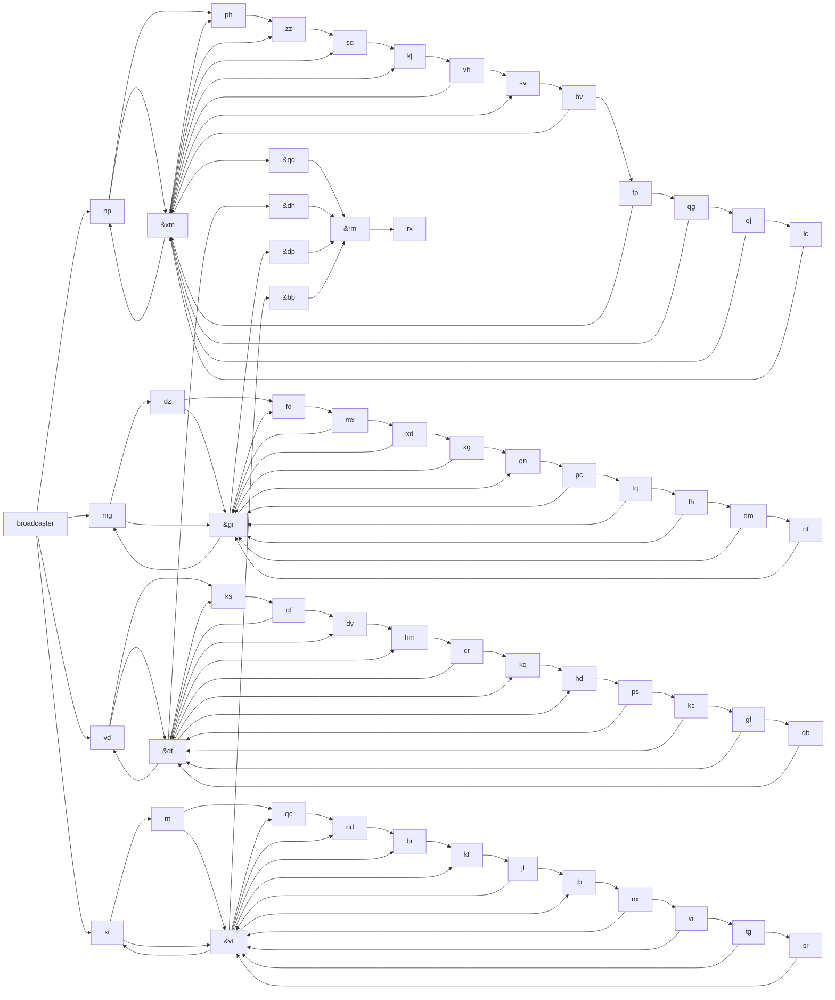

# Day20 Visualize



## Keypoint

There is exactly one low pulse sent to rm (the module before rx) in each part(I haven't figured out why).

```txt
Solution 1: 800830848
Low 1 High 3147 Push loop at 3001
                Low pulse at 3001 Push 0th Pulse

Low 1 High 5256 Push loop at 3027
                Low pulse at 3027 Push 0th Pulse

Low 1 High 3714 Push loop at 2877
                Low pulse at 2877 Push 0th Pulse

Low 1 High 4434 Push loop at 2907
                Low pulse at 2907 Push 0th Pulse

Solution 2: 244055946148853
```

And if the low pulse is not at final push's first pulse. Then the problem will be a very complex CRT (Chinese Remainder Theory) problem.

Actually [2024 Day 14 Restroom Redoubt](../../2024/Day14/RobotPatrol.h) utilized an implemention of this theory.
