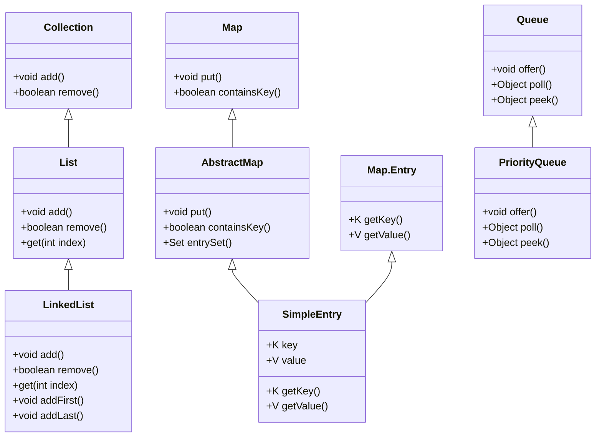

```mermaid
classDiagram
    class Collection {
        +void add()
        +boolean remove()
    }

    class List {
        +void add()
        +boolean remove()
        +get(int index)
    }

    class LinkedList {
        +void add()
        +boolean remove()
        +get(int index)
        +void addFirst()
        +void addLast()
    }

    class Map {
        +void put()
        +boolean containsKey()
    }

    class AbstractMap {
        +void put()
        +boolean containsKey()
        +Set entrySet()
    }

    class Map.Entry {
        +K getKey()
        +V getValue()
    }

    class SimpleEntry {
        +K key
        +V value
        +K getKey()
        +V getValue()
    }

    class Queue {
        +void offer()
        +Object poll()
        +Object peek()
    }

    class PriorityQueue {
        +void offer()
        +Object poll()
        +Object peek()
    }

    Collection <|-- List
    List <|-- LinkedList

    Map <|-- AbstractMap
    AbstractMap <|-- SimpleEntry
    Map.Entry <|-- SimpleEntry

    Queue <|-- PriorityQueue

```
