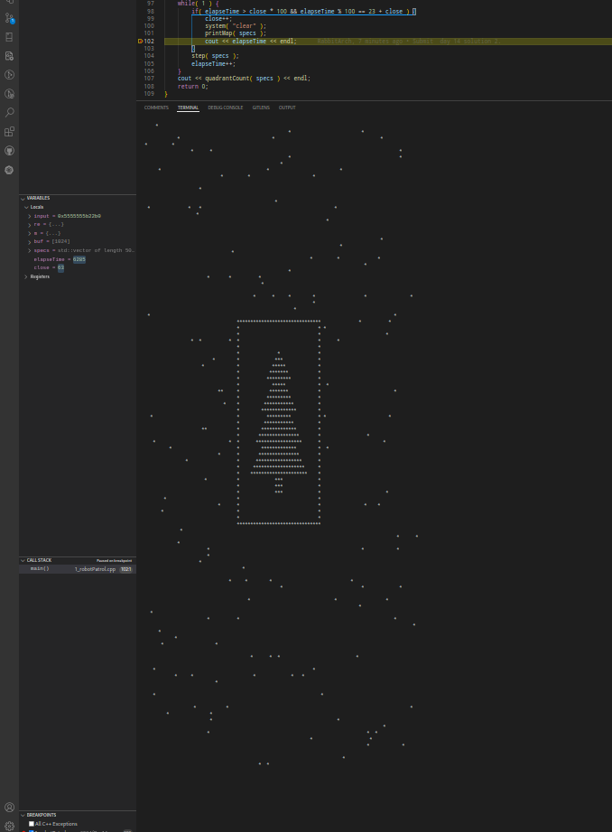

# Advent of Code Solutions

Solutions to [Advent of Code](https://adventofcode.com/) challenges. Advent of Code is an annual coding event with daily programming puzzles released from December 1st to December 25th.

## 🚀 Solutions

### 2024 Progress: 25/25 ⭐⭐

 Day                                                                                                                                  | Part 1 | Part 2 | Cpp Solution                                                                                                | Java Solution
--------------------------------------------------------------------------------------------------------------------------------------|:------:|:------:|:-----------------------------------------------------------------------------------------------------------:|:----------:
        |   ⭐   |   ⭐   |           | 
        |   ⭐   |   ⭐   |    | 
            |   ⭐   |   ⭐   |           | 
              |   ⭐   |   ⭐   |          | 
               |   ⭐   |   ⭐   |      | -
           |   ⭐   |   ⭐   |          | -
             |   ⭐   |   ⭐   |          | -
           |   ⭐   |   ⭐   |          | -
     |   ⭐   |   ⭐   |       | -
                |   ⭐   |   ⭐   |         | -
      |   ⭐   |   ⭐   |          | -
          |   ⭐   |   ⭐   |               | -
       |   ⭐   |   ⭐   |         | -
       |   ⭐   |   ⭐   |          | -
         |   ⭐   |   ⭐   |            | -
          |   ⭐   |   ⭐   |         | -
 |   ⭐   |   ⭐   |          | -
                |   ⭐   |   ⭐   |               | -
           |   ⭐   |   ⭐   |          | -
         |   ⭐   |   ⭐   |        | -
       |   ⭐   |   ⭐   |      | -
          |   ⭐   |   ⭐   |         | -
              |   ⭐   |   ⭐   |             | -
          |   ⭐   |   ⭐   |      | -
         |   ⭐   |   💫   |              | -

### Other years

 Year | Progress
:----:|:----------:
2023  | 5/25 ⭐⭐

## 💻 Tools

- IDE :  
- Cpp Compiler: %2014.2.1%2020240910-grey)
- C++ standard: 
- JVM Version: 
- OS: 

## 📜 Worth future utility

### Day 9 Disk Fragmenter

  

  

### Day 11 Plutonian Pebbles

The multithreading approach has crashed my OS many times. The dynamic programming method is fruitful. However, what if the position of spawned stones matters in the result calculation?

### Day 12 Garden Groups

This problem guides a way of image edge detection algorithm.

  

### Day 14 Restroom Redoubt

  

### Day 15 Warehouse Woes

A simple box pushing game.

  

### Day 16 Dijkstra + State transfer machine

Prove:

1. Each vertex in the shortest path is enqued in the order of the shotest path itself.
2. Any equivalent cost path is enqued once.
3. Once a vertex is relaxed, the path is already in **current** optimal status, this status will be settled when poped from the priority queue.

### Day 24 Crossed Wires

[Cascading Full adder](./2024/Day24/GatesVisualize.md)

## 🔗 Links

- [Advent of Code](https://adventofcode.com/)
- [About Advent of Code](https://adventofcode.com/about)
- [This README's template](https://github.com/TrueBurn/advent-of-code)
- [Markdown emoji](<https://gist.github.com/rxaviers/7360908>)

## 📆 TODOs

- [x] Change day 3 algorithm to [regular expression](https://en.cppreference.com/w/cpp/regex/ecmascript) implementation ([C++ 11 feature](https://en.cppreference.com/w/cpp/regex)).
- [ ] What is day 13 algorithm trying to testify?
- [ ] Building java repo.
- [ ] Construct the project to a CMake test project.
- [ ] Add cache to Dijkstra in Day 21 solution.
- [ ] ~~Add A*algorithm to Day 16 solution.~~ Nah, A* algo is not suitable for penalty shortest path problem.
- [ ] Change Day 20 distance calculation to Manhattan distance.
- [ ] Github issue at: [13110](https://github.com/microsoft/vscode-cpptools/issues/13110)
- [ ] Mutex > future async > normal algorithm (VSCode debugger will try tracking the calling stack, thus recursive algorithm will be slowed down severely).

<!-- 

    <input type="checkbox" checked="true" disabled="true" >Change day 3 algorithm to <a href="https://en.cppreference.com/w/cpp/regex/ecmascript">regular expression</a> implementation <a href="https://en.cppreference.com/w/cpp/regex">(C++ 11 feature)</a>. 
    <input type="checkbox" disabled="true" >What is day 13 algorithm trying to testify? 
    <input type="checkbox" disabled="true" >Get a lisence. 
    <input type="checkbox" disabled="true" >Construct the project to a CMake test project. 
    <input type="checkbox" disabled="true" >Add cache to Dijkstra in Day 21 solution. 
    <input type="checkbox" disabled="true" >Github issue at: <a href="https://github.com/microsoft/vscode-cpptools/issues/13110">13110</a> 
    <input type="checkbox" disabled="true" >Mutex > future async > normal algorithm (vscode debugger will try tracking the calling stack, thus recursive algorithm will be slowed down serverely) 

 -->

## Statistics

Language    |files|blank|comment|code
--------    |-----|-----|-------|----
C++         |41   |364  |433    |4141
Java        |11   |151  |34     |1263
C/C++ Header|7    |48   |100    |651
SUM:        |59   |563  |567    |6055
