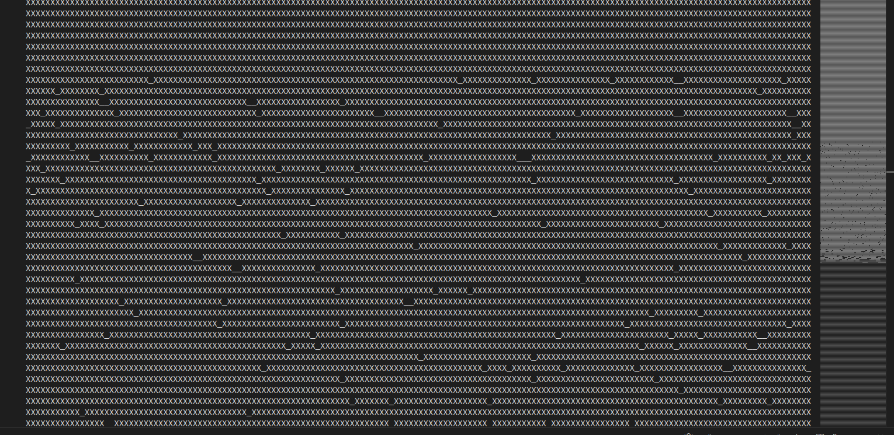

# 🎄 Advent of Code Solutions

Solutions to [Advent of Code](https://adventofcode.com/) challenges. Advent of Code is an annual coding event with daily programming puzzles released from December 1st to December 25th.

## 🚀 Solutions

### 2024 Progress: 13/25 ⭐⭐

 Day | Part 1 | Part 2 | Solution to P1 | Solution to P2
-----|:------:|:------:|:----------:|:----------:
 | ⭐ | ⭐ |  |
 | ⭐ | ⭐ |  |
 | ⭐ | ⭐ |  |
 | ⭐ | ⭐ |  |
 | ⭐ | ⭐ |  |
 | ⭐ |⭐| |
 |⭐|⭐||
 |⭐|⭐||
 |⭐|⭐||
 |⭐|⭐||
 |⭐|⭐||
 |⭐|⭐||
 |⭐|⭐||
 |⭐|-||-
 |-|-|-|-
 |-|-|-|-
 |-|-|-|-
 |-|-|-|-
 |-|-|-|-
 |-|-|-|-
 |-|-|-|-
 |-|-|-|-
 |-|-|-|-
 |-|-|-|-
 |⭐|22⭐ lack||-

## 💻 Tools

- IDE :  
- Compiler: %2014.2.1%2020240910-grey)
- C++ standard: 
- OS: 

## 📜 Worth future utility

### Day 9 Disk Fragmenter

### Day 11 Plutonian Pebbles

The multithreading aproach has crashed my OS many times. The dynamic programming method is fruitful. However, what if the position of spawned stones matters in the result calculation?

### Day 12 Garden Groups

This problem guides a way of image edge detection algorithm.

## 🔗 Links

- [Advent of Code](https://adventofcode.com/)
- [About Advent of Code](https://adventofcode.com/about)
- [This README's template](https://github.com/TrueBurn/advent-of-code)
- [Markdown emoji](<https://gist.github.com/rxaviers/7360908>)

## 📆 TODOs

- Change Day3 algorithm to [regular expression](https://en.cppreference.com/w/cpp/regex/ecmascript) implementation([C++11 feature](https://en.cppreference.com/w/cpp/regex)).
- What does day 13 algorithm wants to testify?
